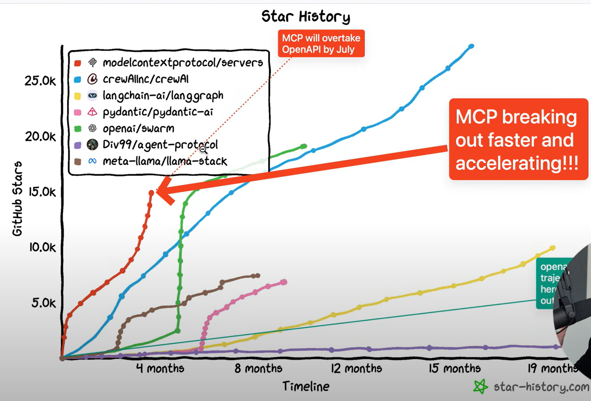
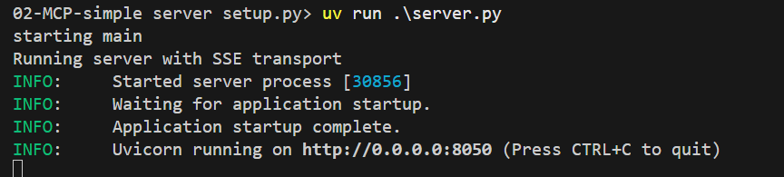
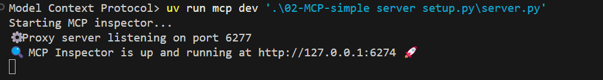

# History

# Terminology

- MCP Hosts
- MCP clients
- MCP Servers

Transport Mechanisms 

- Stdio (Standard IO)
- SSE (Server-Sent Events)

# setup env

    uv add "mcp[cli]"

# MCP Inspector

    uv run .\server.py

    uv run mcp dev server.py

